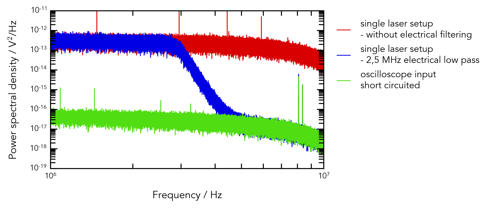

# Data Analysis - Science Plots

This is a repo containing a few of my data analysis notebooks I created during the scope of my research in laser physics. It demonstrates a few of my skills in:
* Numpy & Pandas 
* Matplotlib
* Data processing and analysis including complex scientific calculations 

Below you can find a variety of plots I created using Pandas & Matplotlib.
## Description

## Python 
The code is entirely written in Python. It utilizes the Pandas and Matplotlib framework.

## Dependencies for Running Locally
* Jupyter Lab: pip3 install jupyterlab
* Pandas: pip3 install pandas
* Matplotlib:: pip3 install matplotlib
* ImageIO: pip3 install imageio

## Basic Build Instructions

1. Clone this repo.
2. Launch Jupyter Lab.
3. Open Notebook.
4. Run.
